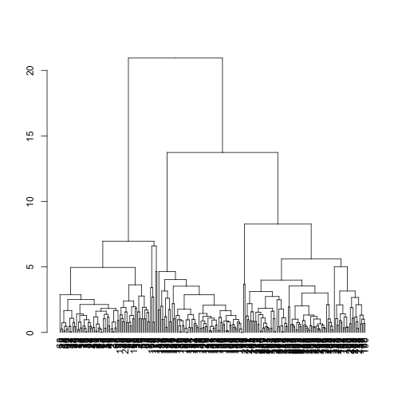

## packages

This vignette needs the following packages to run

```
library(SurvivalClusteringTree)
library(survival)
library(tidyverse)
library(WeightedCluster)
```

## Simulation of data

We simulate a data set with 3 groups of 80 observations each. All of the group follow a [Weibull distribution](https://en.wikipedia.org/wiki/Weibull_distribution) but with different shape and scale parameters.
We simulate as well 3 continuous variables $x_1$, $x_2$ and $x_3$ and 2 binaries variables $z_1$ and $z_2$.

```
set.seed(0)
simulated_data<-
  data.frame(label=rep(c("A","B","C"),c(80,80,80)))%>%
  mutate(
    time=case_when(
      label=="A"~rweibull(n(),shape=2,scale=2),
      label=="B"~rweibull(n(),shape=2,scale=5),
      label=="C"~rweibull(n(),shape=2,scale=3)),
    survtime=pmin(time,10),
    survevent=time<10)%>%
  select(-time)%>%
  mutate(
    x1=case_when(
      label=="A"~rnorm(n(),0),
      label=="B"~rnorm(n(),3),
      label=="C"~rnorm(n(),3)),
    x2=case_when(
      label=="A"~rnorm(n(),3),
      label=="B"~rnorm(n(),0),
      label=="C"~rnorm(n(),3)),
    x3=case_when(
      label=="A"~rnorm(n(),0),
      label=="B"~rnorm(n(),0),
      label=="C"~rnorm(n(),2)),
    z1=case_when(
      label=="A"~sample(c("F1","F2"),n(),replace=T,prob=c(0.8,0.2)),
      label=="B"~sample(c("F1","F2"),n(),replace=T,prob=c(0.5,0.5)),
      label=="C"~sample(c("F1","F2"),n(),replace=T,prob=c(0.2,0.8))),
    z2=case_when(
      label=="A"~sample(c("G1","G2"),n(),replace=T,prob=c(0.7,0.3)),
      label=="B"~sample(c("G1","G2"),n(),replace=T,prob=c(0.1,0.9)),
      label=="C"~sample(c("G2","G2"),n(),replace=T,prob=c(0.4,0.6))))
```

First, we fit a set of trees with the `survival_forest` function.
```
a_survival_forest<-
  survival_forest(
    survival_outcome=Surv(survtime,survevent)~1,
    numeric_predictor=~x1+x2+x3,
    factor_predictor=~z1+z2,
    data=simulated_data,
    nboot=100,
    min_weights=20)
```

We then compute the distance between the observation using the `predict_distance_forest` function.
```
a_distance<-predict_distance_forest(
  a_survival_forest,
  numeric_predictor=~x1+x2+x3,
  factor_predictor=~z1+z2,
  data=simulated_data)
```

Once the distances have been computed, it is possible to explore how the observatins are related to each other. In this example it appears that there are 3 large clusters which different strongly from each others.
```
a_dist<-as.dist(a_distance$mean_distance)
a_cmdscale_fit<-cmdscale(a_dist)

a_hclust<-hclust(a_dist,method="average")
a_dendrogram<-as.dendrogram(a_hclust)
plot(a_dendrogram)
```


It is possible to identify the optimum number of clusters by identifying the cut off with the largest ASWw.
```
a_clustrange<-as.clustrange(a_hclust,diss=a_dist,ncluster=10)
df_ASWw<-data.frame(nclus=2:10,ASWw=a_clustrange$stats[,"ASWw"])
ggplot(df_ASWw,aes(x=nclus,y=ASWw))+geom_line()+geom_vline(xintercept=3,lty=2)+theme_bw()
```


Finaly, it is possible to identify how the observations are similar and how does the clustering model performs.
```
result_data<-data.frame(
  x=a_cmdscale_fit[,1],
  y=a_cmdscale_fit[,2],
  truth=simulated_data$label,
  cluster=factor(cutree(a_hclust,3)))

gridExtra::grid.arrange(
  ggplot(result_data,aes(x=x,y=y,color=truth))+geom_point()+theme_bw(),
  ggplot(result_data,aes(x=x,y=y,color=cluster))+geom_point()+theme_bw(),ncol=2)

```
